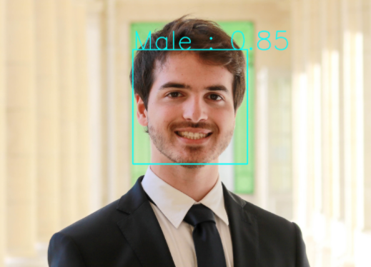

# Face-gender-recognition-web-app

A face detector and gender prediction web application using Computer Vision and Machine Learning. 

## Get started

Make sure beforehand that you have all the requisite libraries installed by executing `pip install -r requirements.txt`.  
In order to test the web application locally, execute `python main.py` at the project's root to run flask server on localhost port 8000 (127.0.0.1:8000 in your favorite web browser). 

## Tech Stack
*  Python for backend
   *  Flask, a micro web framework used as a router and a template rendering engine
   *  OpenCV, an image processing library
   *  Pandas, a data analysis library
   *  Matplotlib, a visualization library
   *  Scikit-Learn, to build our ML models
*  HTML/CSS and Bootstrap 4 for the web-UI
